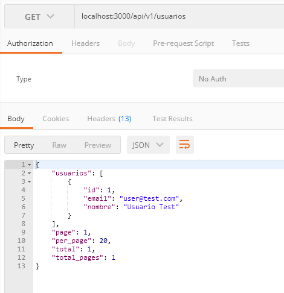
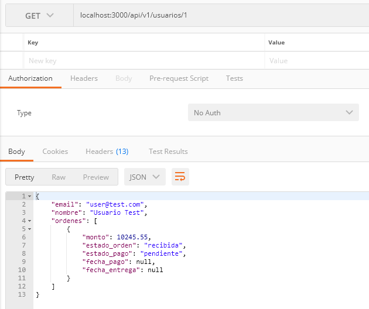
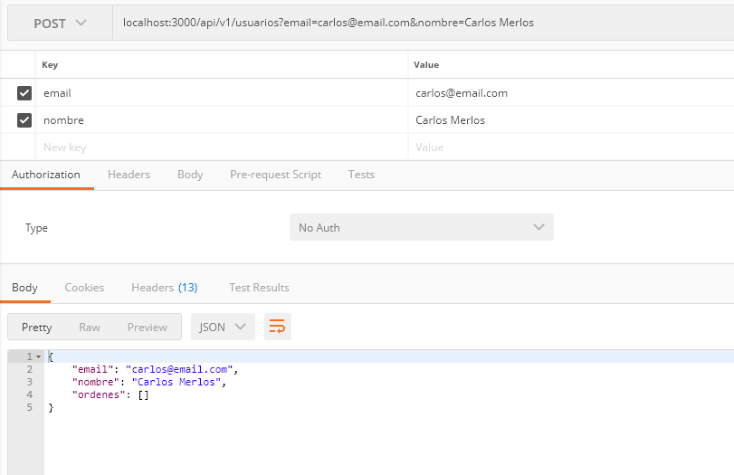
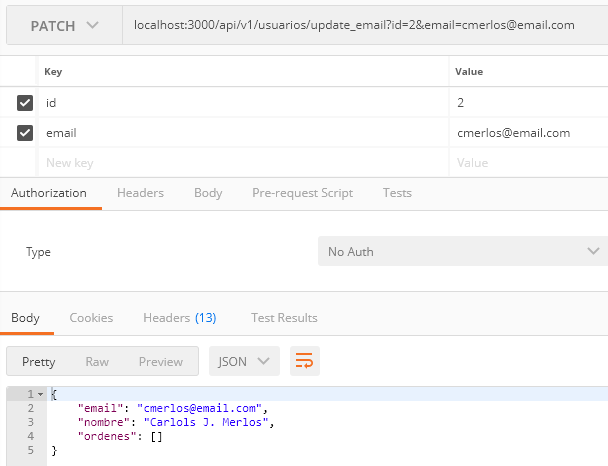
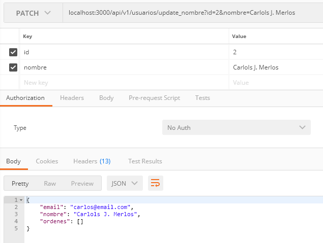
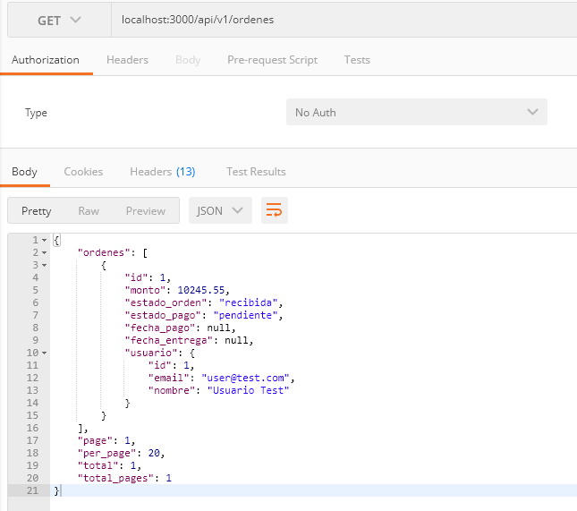
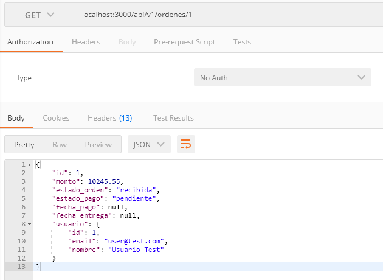

# README

This README would normally document whatever steps are necessary to get the
application up and running.

Things you may want to cover:

* Ruby version: 2.7.2

* System dependencies:Postgres

# Para levantar la aplicacion con docker lo primero que se debe hacer es iniciar el docker-compose

`docker-compose up`

# Para visualizar la lista de usuarios dirigirse al endpoint de usuarios

**GET** `localhost:3000/api/v1/usuarios`
* acepta los parametros: [busqueda, page, per_page]
* busqueda: Permite buscar en en el email o nombre del usuario
* page y per_page: Sirven para la paginacion, per_page es el limite por pagina y page la pagina que deseamos ver

# Para visualizar un usuario en especifico

**GET** `localhost:3000/api/v1/usuarios/1`

# Para crear un nuevo usuario

**POST** `localhost:3000/api/v1/usuarios?email=doe@email.com&nombre=John Doe`
* acepta los parametros: [nombre, email]

# Para modificar el email de un usuario en especifico

**PATCH** `localhost:3000/api/v1/usuarios/update_email?id=2&email=prueba@email.com`
* acepta los parametros: [id, email]

# Para modificar el nombre de un usuario en especifico

**PATCH** `localhost:3000/api/v1/usuarios/update_nombre?id=2&email=Nuevo Nombre`
* acepta los parametros: [id, nombre]

# Para eliminar un usuario en especifico

**DELETE** `localhost:3000/api/v1/usuarios/1`
* Elimina el registro si no tiene ordenes relacionadas

# Para visualizar la lista de ordenes

**GET** `localhost:3000/api/v1/ordenes`
* acepta los parametros: [fecha_entrega, page, per_page]
* fecha_entrega: Permite filtrar registros por la fecha de entrega
* page y per_page: Sirven para la paginacion, per_page es el limite por pagina y page la pagina que deseamos ver

# Para visualizar un usuario en especifico

**GET** `localhost:3000/api/v1/ordenes/1`

# Para crear un nueva orden

**POST** `localhost:3000/api/v1/ordenes?usuario_id=1&monto=125.55`
* acepta los parametros: [usuario_id, monto, estado_pago, estado_orden, fecha_pago, fecha_entrega]
* usuario_id: **Requerido** debe ser el id de un usuario existente en la base de datos
* monto: **Requerido** acepta valores numericos
* estado_pago: Solo acepta los valores [pendiente, pagada, no_pagada] si no se define asigna **pendiente**
* estado_orden: Solo acepta los valores [recibida, en_preparacion, en_reparto, entregada] si no se define asigna **recibida**
* fecha_pago: es requerida si asigna el valor pagada al estado_pago
* fecha_entrega: es requerida si asigna el valor entregada al estado_orden

# Para actulizar el estado de pago

**PATCH** `localhost:3000/api/v1/ordenes/update_estado_pago?id=2&estado_pago=pagada`
* acepta los parametros: [id, estado_pago, fecha_pago]
* id: **Requerido** debe ser el id de una orden existente
* monto: **Requerido** acepta valores numericos
* estado_pago: **Requerido** Solo acepta los valores [pendiente, pagada, no_pagada]
* fecha_pago: es requerida si asigna el valor pagada al estado_pago, si no se define un valor se actualiza con el valor de fecha y hora actual

# Para actualizar el estado de despacho o estado de la orden

**PATCH** `localhost:3000/api/v1/ordenes?update_estado_despacho?id=2&estado_pago=pagada`
* acepta los parametros: [id, estado_orden, fecha_entrega]
* id: **Requerido** debe ser el id de una orden existente
* estado_orden: **Requerido** Solo acepta los valores [recibida, en_preparacion, en_reparto, entregada]
* fecha_entrega: es requerida si asigna el valor entregada al estado_orden, si no se define un valor se actualiza con el valor de fecha y hora actual

# Para eliminar una orden
**DELETE** `localhost:3000/api/v1/ordenes/1`
* Elimina el registro